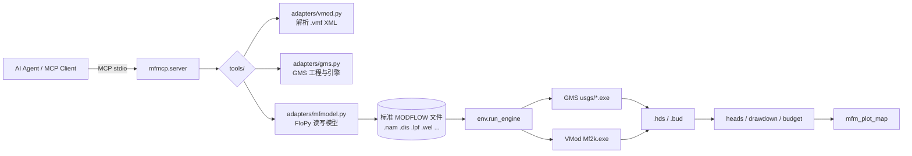

# gms-vmod-mcp

> 让 AI Agent 用自然语言驱动 **Aquaveo GMS** 与 **Visual MODFLOW** —— 建模、改参、跑引擎、读结果、出图。

*An MCP server that lets AI agents drive Aquaveo GMS and Visual MODFLOW headlessly —
build, edit parameters, run the bundled USGS engines, read heads / drawdown / budget, and plot.*

[](LICENSE)
[](https://www.python.org/)
[](https://modelcontextprotocol.io/)
[](#)

用 FloPy 接管**标准 MODFLOW 文件**，直接命令行调用两家软件**自带的 USGS 数值引擎**，
通过 [MCP](https://modelcontextprotocol.io/) 把「读模型 → 改参数 → 跑 → 读水头/降深 → 出图」
这条链路暴露给任何支持 MCP 的 AI 客户端。

实测 **30 个 MCP 工具**、识别 **16 个可用引擎**，并用两家引擎跑同一模型交叉验证结果一致。

---

## 目录

- [这是什么](#这是什么)
- [为什么可行](#为什么可行)
- [支持的软件与引擎](#支持的软件与引擎)
- [快速开始](#快速开始)
- [注册到 MCP 客户端](#注册到-mcp-客户端)
- [工具清单](#工具清单)
- [典型工作流](#典型工作流)
- [端到端验证](#端到端验证)
- [架构](#架构)
- [已知限制](#已知限制)
- [踩坑记录](#踩坑记录)
- [License](#license)

---

## 这是什么

GMS 和 Visual MODFLOW 都是**图形界面**的前后处理器，没有面向自动化的开放 API
（GMS 的 `xms_api` 是客户端 API，必须连到正在运行的 GUI 进程，无法无头运行）。
这让 AI 很难直接插手。

本项目换了个切入点：**它们产出的东西是标准的**。

- 两者的模型都能导出/落盘为**标准 MODFLOW 输入文件**（`.nam` / `.dis` / `.lpf` / `.wel` …）
- 两者的安装目录里都**自带 USGS 编译的数值引擎 exe**（`mf2005.exe` / `Mf2k.exe` / `mt3dms.exe` …）

于是只要「用 FloPy 统一读写模型文件 + 用 subprocess 直接调引擎」，
就能在**完全不启动 GUI、不需要交互**的前提下，把整套建模—运行—后处理自动化掉。

```
AI Agent ──MCP──> gms-vmod-mcp ──┬──> FloPy        (读写标准 MODFLOW 文件)
                                 ├──> mf2005.exe   (GMS 自带的 USGS 引擎)
                                 └──> Mf2k.exe     (Visual MODFLOW 自带的引擎)
```

## 为什么可行

| | Aquaveo GMS | Visual MODFLOW |
|---|---|---|
| 工程格式 | `.gpr`（私有二进制，外部不可解析） | `.vmf`（**完整 XML，可程序化读写**） |
| NAME FILE | 需先在 GUI 里导出为 MODFLOW 文本 | `*.mfi`（内含安装时**绝对路径**，换机需本地化） |
| 对外 API | `xms_api`（客户端 API，必须 GMS 进程在跑） | 无 |
| 引擎 | `models/*/usgs/*.exe` | 安装根目录 `Mf2k.exe` 等 |
| 能否无头运行 | ✅ 走引擎 exe | ✅ 走引擎 exe |

关键结论：**两家本质都是 MODFLOW 的前后处理器**，可自动化的是它们共有的「标准 MODFLOW」这一层。

## 支持的软件与引擎

已实测识别 **16 个引擎**：

**Aquaveo GMS**（9 个，自动优选 `usgs/` 原版构建）

| 类别 | 引擎 |
|---|---|
| 水流 | MODFLOW-2000 / 2005 / NWT / MF6 |
| 溶质运移 | MT3DMS、MT3D-USGS、PHT3D |
| 粒子追踪 | MODPATH |
| 均衡 | Zone Budget |

**Visual MODFLOW**（7 个）

| 类别 | 引擎 |
|---|---|
| 水流 | MODFLOW-2000（`Mf2k.exe`）/ MODFLOW-96 |
| 溶质运移 | MT3DMS、MT3D96 |
| 粒子追踪 | MODPATH 3.2 |
| 均衡 | Zone Budget |
| 参数估计 | PEST |

## 快速开始

### 1. 安装

```bash
git clone https://github.com/chenzy0355/gms-vmod-mcp.git
cd gms-vmod-mcp

python -m venv .venv
.venv\Scripts\python.exe -m pip install -e .
```

需要 Python ≥ 3.10。依赖：`flopy`、`mcp`、`numpy`、`pandas`、`matplotlib`。

### 2. 配置本机安装路径

复制示例配置，改成你本机的实际路径：

```bash
copy config\env.example.json config\env.json
```

```jsonc
// config/env.json —— 此文件已在 .gitignore 中，不会被提交
{
  "gms_home": "C:\\Program Files\\GMS 10.4 64-bit",
  "vmod_home": "C:\\Program Files\\Visual MODFLOW 4.0",
  "workspace": "",             // 留空 = <repo>/workspace
  "extra_engine_dirs": []      // 可选：额外搜索引擎 exe 的目录
}
```

留空则按环境变量 `GMS_HOME` / `VMOD_HOME` 和常见安装位置自动探测。

### 3. 自检

```bash
set PYTHONPATH=%CD%\src

python -m mfmcp.server --check     # 列出全部 MCP 工具
python -m mfmcp.server --info      # 打印探测到的软件与引擎
python tests\smoke.py              # 适配器自检
python tests\e2e.py                # 端到端：两家引擎各跑一个真实模型 + 出图
```

> Windows 用户也可直接双击 `run.cmd --info`。

## 注册到 MCP 客户端

任选其一，把下面这段加进客户端的 MCP 配置（路径改成你的实际位置）。

<details open>
<summary><b>Claude Desktop / Cursor / Cline / VS Code（stdio）</b></summary>

```json
{
  "mcpServers": {
    "gms-vmod": {
      "command": "C:\\path\\to\\gms-vmod-mcp\\.venv\\Scripts\\python.exe",
      "args": ["-m", "mfmcp.server"],
      "env": {
        "PYTHONPATH": "C:\\path\\to\\gms-vmod-mcp\\src",
        "PYTHONIOENCODING": "utf-8",
        "PYTHONUTF8": "1"
      }
    }
  }
}
```

> 各客户端配置文件位置：Claude Desktop → `%APPDATA%\Claude\claude_desktop_config.json`；
> Cursor → `.cursor/mcp.json`；VS Code → `~/.vscode/mcp.json`。

</details>

> ⚠️ **不要**在 `env` 里设置 `PYTHONWARNINGS=ignore` —— 实测会让本服务在处理 `tools/list`
> 时卡死。第三方库的告警噪声已在代码内用 `warnings.filterwarnings` 过滤（见[踩坑记录](#踩坑记录)）。

## 工具清单

共 **30 个**工具，按域划分：

| 域 | 工具 |
|---|---|
| 环境 / 发现 | `mfm_env` `mfm_engines` `mfm_scan` `mfm_xms_status` |
| Visual MODFLOW 工程 | `vmod_info` `vmod_search_params` `vmod_list_params` `vmod_set_params` `vmod_set_engine` `vmod_run_engine` `vmod_read_namefile` `vmod_portable_namefile` `gms_export_hint` |
| 模型读写 | `mfm_load` `mfm_summary` `mfm_cached` `mfm_drop` `mfm_get_array` `mfm_set_array` `mfm_save` `mfm_bc_list` `mfm_bc_edit` |
| 运行 | `mfm_run` `mfm_run_engine_direct` |
| 结果 | `mfm_heads` `mfm_drawdown` `mfm_budget` |
| 出图 | `mfm_plot_map` `mfm_plot_timeseries` `mfm_plot_compare` |

## 典型工作流

一句话就能串起来：

> 「把这个模型的渗透系数减半、抽水量放大到 1.5 倍，跑一遍，出一张降深等值线图。」

对应的工具链：

```
mfm_env                        # 摸清两套软件与可用引擎
vmod_info / mfm_scan           # 找到手上的模型
mfm_load  → mfm_summary        # 载入并概览
mfm_set_array / mfm_bc_edit    # 改参数、改边界（井/补给/定水头）
mfm_run(vendor="vmod")         # 跑（VMod 引擎体积小、启动快）
mfm_heads / mfm_drawdown       # 读水头场 / 降深场
mfm_plot_map                   # 出等值线图
```

## 端到端验证

用一个承压含水层抽水模型（1 层 15×15，T = 500 m²/d，中心井抽水 1000 m³/d）
**分别用两家的引擎各跑一次**，结果互相印证：

| 引擎 | 终止状态 | 水头范围 | 井心降深 |
|---|---|---|---|
| GMS `usgs/mf2005.exe` | Normal termination | 28.27 – 30.00 m | 1.73 m |
| Visual MODFLOW `Mf2k.exe` | 收敛（该构建不打印 Normal termination） | 28.27 – 30.00 m | 1.73 m |

| GMS `mf2005.exe` | Visual MODFLOW `Mf2k.exe` |
|---|---|
|  |  |

复现：`python tests\e2e.py`（会重建模型、跑两个引擎、出图到 `workspace/figs/`）。

## 架构



```
src/mfmcp/
├── server.py              # MCP 入口（兼容 mcp 1.x FastMCP / 2.x MCPServer）
├── env.py                 # 软件与引擎探测、引擎调用、配置
├── state.py               # 已载入模型的内存缓存
├── adapters/
│   ├── vmod.py            # .vmf(XML) 读写、.mfi 本地化、参数扫描
│   ├── gms.py             # GMS 工程发现、xms_api 探测
│   └── mfmodel.py         # FloPy 模型载入/改参/运行/结果
└── tools/                 # 按域拆分的 MCP 工具注册
```

## 已知限制

- **Windows only**（引擎 exe 与路径风格均为 Windows）。
- **必须已安装 GMS / Visual MODFLOW** —— 本项目**不打包**任何厂商的引擎或求解器，
  只调用你本机已授权的安装。请自行确保许可合规。
- GMS 的 `.gpr` 工程**无法直接解析**，需先在 GUI 里导出为 MODFLOW 文本再接管。
- `xms_api` 仅用于「GMS 已打开时」的增强探测，**不作为硬依赖**（无法无头运行）。
- 目前面向 MODFLOW-2000/2005/NWT 系列；MF6 的引擎可识别但工具链尚未完整覆盖。

## 踩坑记录

> 这些坑都是实测踩出来的，改代码前建议先读。

1. **工程目录不能叫 `mcp`**。若项目放在名为 `mcp/` 的目录下，Python 会把它当成
   `mcp` 命名空间包，把官方 MCP SDK 完全遮蔽 → `import mcp` 拿到的是你自己的目录。
2. **不要设 `PYTHONWARNINGS=ignore`**。实测会让服务在 `tools/list` 阶段卡死
   （只回 `initialize`、不回 `tools`）。噪声改用代码内 `warnings.filterwarnings` 处理。
3. **老式 USGS 引擎从 stdin 读 NAME FILE 名**，不接受命令行参数；
   VMod 的 `Mf2k.exe` 还会把 argv 当成「工程名前缀」。
   `env.run_engine` 已实现「先 stdin、失败再 argv」并自动重试。
4. **VMod 的 `Mf2k.exe` 不打印 `Normal termination`**（改装过的构建）。
   成功判定因此改为「无报错 + 收敛 + 产出新的 `.hds` / `.lst`」，而非匹配日志字符串。
5. **GMS 同名引擎有多个变种**：`_cfp_`（管道流模型，物理不同）、`_h5_`（HDF5 封装）、
   `_parallel` / `_dbl`。`env` 会优先挑选 `models/*/usgs/*.exe` 原版构建。
6. **`mcp` SDK 2.x 把 `FastMCP` 改名 `MCPServer`**，且 `InitializeResult` 字段为
   `server_info`。`server.py` 已做 1.x / 2.x 双兼容。

## License

[MIT](LICENSE)

> 本项目与 Aquaveo LLC、Waterloo Hydrogeologic 无隶属关系。
> GMS® 与 Visual MODFLOW® 为其各自所有者的商标。本项目不包含、不分发任何厂商软件。
