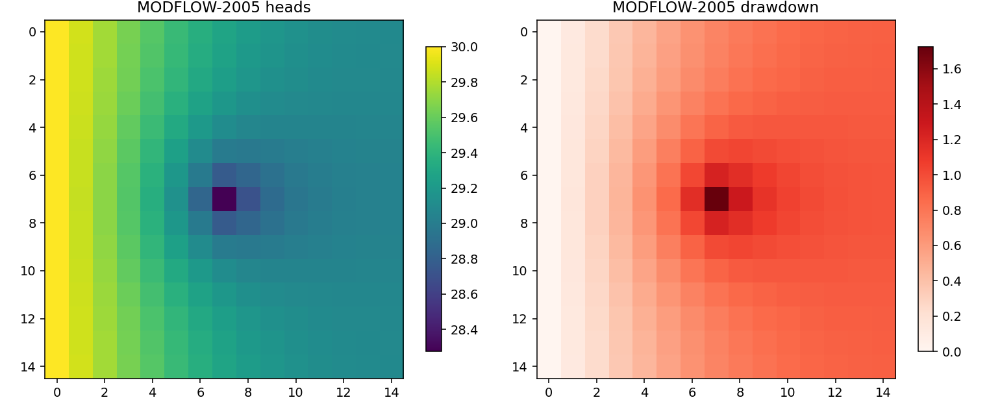

[简体中文](README.md) · [English](README.en.md)

# gms-vmod-grapher-mcp

[](LICENSE)
[](https://www.python.org/)
[](https://modelcontextprotocol.io/)
[](#)

通过 MCP 把 Aquaveo GMS、Visual MODFLOW 与 Golden Software Grapher 接入 AI 客户端。

GMS 与 Visual MODFLOW 负责建模与求解：用 FloPy 读写标准 MODFLOW 文件，再通过子进程调用
这两款软件自带的 USGS 引擎，把加载模型、修改参数、运行、读取水头与降深这些操作封装成 MCP 工具。

Grapher 负责后处理绘图：不做数值计算，通过 `Scripter.exe` 驱动脚本，把抽水试验拟合曲线、
散点图与等值线等结果输出为 `.grf` 工程与 `.png` 图件。

当前版本注册 39 个工具，可识别 16 个引擎。

## 背景

GMS 和 Visual MODFLOW 都是图形界面的前后处理器，没有可以直接调用的开放 API。
GMS 的 `xms_api` 属于客户端 API，需要连接到正在运行的 GUI 进程，无法独立运行。
这两个软件都无法脱离界面做自动化。

Grapher 是 Golden Software 出品的专业绘图软件，本身不做数值计算，但提供了
`Scripter.exe` 脚本引擎，可以在命令行下由脚本驱动完成作图，因此适合作为结果出图的后端。

可用的切入点在于两者的产物都是标准格式：

- 模型可以导出为标准的 MODFLOW 输入文件（`.nam`、`.dis`、`.lpf`、`.wel` 等）
- 安装目录中带有 USGS 编译的引擎可执行文件（`mf2005.exe`、`Mf2k.exe`、`mt3dms.exe` 等）

所以只要用 FloPy 读写模型文件，再用子进程调用引擎，就能在不启动界面的情况下完成
建模、运行和后处理。

## 三款软件的分工

GMS 与 Visual MODFLOW 同为建模与求解工具，Grapher 则是它们的出图后端。

| | Aquaveo GMS | Visual MODFLOW | Golden Software Grapher |
|---|---|---|---|
| 角色 | 建模 + 求解 | 建模 + 求解 | 后处理绘图 |
| 工程格式 | `.gpr`，私有二进制，外部无法解析 | `.vmf`，XML，可以程序化读写 | `.grf`，由 `.bas` 脚本生成 |
| NAME FILE | 需要先在界面里导出为 MODFLOW 文本 | `*.mfi`，内含安装时的绝对路径，换机后需要本地化 | — |
| 对外 API | `xms_api`，客户端 API，需要 GMS 进程在运行 | 无 | `Scripter.exe`，命令行脚本驱动 |
| 引擎位置 | `models/*/usgs/*.exe` | 安装根目录下的 `Mf2k.exe` 等 | 安装根目录下的 `Scripter.exe` |
| 无界面运行 | 支持，走引擎 | 支持，走引擎 | 支持，走脚本 |

GMS 与 Visual MODFLOW 都属于 MODFLOW 前后处理器，可以复用的部分是标准 MODFLOW 文件这一层；
Grapher 不参与建模与求解，只消费计算结果与实测数据，负责出图。

## 支持的引擎

共 16 个。

**GMS**（9 个，自动跳过 `_cfp_`、`_h5_` 等变种，优先选用 `usgs/` 下的原版构建）

| 类别 | 引擎 |
|---|---|
| 水流 | MODFLOW-2000、2005、NWT、MF6 |
| 溶质运移 | MT3DMS、MT3D-USGS、PHT3D |
| 粒子追踪 | MODPATH |
| 均衡 | Zone Budget |

**Visual MODFLOW**（7 个）

| 类别 | 引擎 |
|---|---|
| 水流 | MODFLOW-2000（`Mf2k.exe`）、MODFLOW-96 |
| 溶质运移 | MT3DMS、MT3D96 |
| 粒子追踪 | MODPATH 3.2 |
| 均衡 | Zone Budget |
| 参数估计 | PEST |

引擎按逻辑名识别，同名引擎可以用 `vendor` 参数区分。

## 安装

需要 Python 3.10 以上。

```bash
git clone https://github.com/chenzy0355/gms-vmod-grapher-mcp.git
cd gms-vmod-grapher-mcp

python -m venv .venv
.venv\Scripts\python.exe -m pip install -e .
```

依赖：`flopy`、`mcp`、`numpy`、`pandas`、`matplotlib`。

## 配置

把示例配置复制为实际配置，再填入本机的安装路径：

```bash
copy config\env.example.json config\env.json
```

```jsonc
// config/env.json
{
  "gms_home": "C:\\Program Files\\GMS 10.4 64-bit",
  "vmod_home": "C:\\Program Files\\Visual MODFLOW 4.0",
  "grapher_home": "C:\\Program Files\\Golden Software\\Grapher 16",
  "workspace": "",          // 留空时使用 <repo>/workspace
  "extra_engine_dirs": []   // 可选的额外引擎搜索目录
}
```

`config/env.json` 已在 `.gitignore` 中，不会提交。留空时会依次尝试环境变量
`GMS_HOME`、`VMOD_HOME`、`GRAPHER_HOME` 和常见安装目录。

自检：

```bash
set PYTHONPATH=%CD%\src

python -m mfmcp.server --check     # 列出全部工具
python -m mfmcp.server --info      # 显示探测到的软件与引擎
python tests\smoke.py              # 适配器自检
python tests\e2e.py                # 运行两个引擎并出图
```

Windows 下也可以直接执行 `run.cmd --info`。

## 注册到 MCP 客户端

以 stdio 方式接入。各客户端的配置文件位置：

| 客户端 | 配置文件 |
|---|---|
| Claude Desktop | `%APPDATA%\Claude\claude_desktop_config.json` |
| Cursor | `.cursor/mcp.json` |
| Cline / Roo Code | 扩展设置中的 MCP 配置 |
| VS Code | `.vscode/mcp.json` |

配置内容：

```json
{
  "mcpServers": {
    "gms-vmod-grapher": {
      "command": "C:\\path\\to\\gms-vmod-grapher-mcp\\.venv\\Scripts\\python.exe",
      "args": ["-m", "mfmcp.server"],
      "env": {
        "PYTHONPATH": "C:\\path\\to\\gms-vmod-grapher-mcp\\src",
        "PYTHONIOENCODING": "utf-8",
        "PYTHONUTF8": "1"
      }
    }
  }
}
```

不要在 `env` 中设置 `PYTHONWARNINGS`，原因见[开发注意事项](#开发注意事项)。
第三方库的告警已在代码内过滤。

## 工具列表

| 域 | 工具 |
|---|---|
| 环境与发现 | `mfm_env` `mfm_engines` `mfm_scan` `mfm_xms_status` |
| Visual MODFLOW 工程 | `vmod_info` `vmod_search_params` `vmod_list_params` `vmod_set_params` `vmod_set_engine` `vmod_run_engine` `vmod_read_namefile` `vmod_portable_namefile` `gms_export_hint` |
| 模型读写与参数修改 | `mfm_load` `mfm_summary` `mfm_cached` `mfm_drop` `mfm_get_array` `mfm_set_array` `mfm_save` `mfm_bc_list` `mfm_bc_edit` |
| 诊断与规则校验 | `mfm_validate_model` `mfm_diagnose_log` |
| 理论验证与敏感性 | `mfm_theis_benchmark` `mfm_sensitivity_analysis` `mfm_check_project` |
| 运行计算 | `mfm_run` `mfm_run_engine_direct` |
| 结果提取 | `mfm_heads` `mfm_drawdown` `mfm_budget` |
| 抽水试验拟合 | `mfm_theis_type_curve_fit` `mfm_jacob_straight_line_fit` |
| Grapher 原生绘图 | `mfm_generate_grapher_script` `mfm_run_grapher_script` |

### 工具功能说明

#### 抽水试验拟合
- `mfm_theis_type_curve_fit`：承压含水层非稳定流 Theis 双对数配线法。输入实测降深数据与抽水量，使用最小二乘拟合求解导水系数 $T$ 与储水系数 $S$。可生成双重平移坐标系（标准曲线与观测曲线分离）的 Grapher 16 自动化脚本（.bas），并调用 Scripter 导出 .grf 工程文件与 .png 图像。
- `mfm_jacob_straight_line_fit`：承压含水层 Cooper-Jacob 半对数直线图解法。按 $u \le 0.05$ 条件筛选有效数据点进行线性回归，计算单对数周期降深差 $\Delta s$ 与零降深截距 $t_0$，求解 $T$ 与 $S$。可生成带回归统计报表框的 Grapher 16 脚本与图像。

#### Grapher 原生绘图
- `mfm_generate_grapher_script`：根据输入数据生成 Grapher 16 自动化脚本（.bas）。
- `mfm_run_grapher_script`：调用本地安装的 Grapher 16 Scripter 引擎执行指定 .bas 脚本。
  调用前需先启动 Grapher 主进程承载 COM 接口，脚本执行完毕后回收进程，避免残留后台句柄。

#### 诊断校验与理论验证
- `mfm_validate_model`：检查网格几何尺寸、顶底板标高合理性、初始水头范围与井抽注流量符号。
- `mfm_diagnose_log`：解析运行输出日志（.lst），提取收敛迭代次数、最大残差所在网格、干涸网格数及水量均衡相对误差。
- `mfm_theis_benchmark`：建立承压含水层标准抽水数值模型，与 Theis 解析解对比，输出平均绝对误差（MAE）与均方根误差（RMSE）。
- `mfm_sensitivity_analysis`：按给定比例调整水力参数（如渗透系数），执行批量计算并输出水头响应变化。
- `mfm_check_project`：检查工程目录完整性与 NAME 文件中的文件引用路径。

## 使用流程

以「把渗透系数减半、抽水量放大到 1.5 倍，运行后出降深等值线图」为例：

```
mfm_env                        查看两个软件与可用引擎
vmod_info / mfm_scan           找到手上的模型
mfm_load  → mfm_summary        载入并查看概况
mfm_set_array / mfm_bc_edit    修改参数与边界条件
mfm_run(vendor="vmod")         运行，vendor 可选 "gms" 或 "vmod"
mfm_heads / mfm_drawdown       读取水头与降深
mfm_plot_map                   出等值线图
```

只运行不加载模型时，可以用 `mfm_run_engine_direct(engine_key, namefile)`。

## 验证

用一个承压含水层抽水模型（1 层，15 × 15 网格，T = 500 m²/d，中心井抽水 1000 m³/d），
分别用两个软件的引擎运行：

| 引擎 | 终止状态 | 水头范围 | 井心降深 |
|---|---|---|---|
| GMS `usgs/mf2005.exe` | Normal termination | 28.27 – 30.00 m | 1.73 m |
| Visual MODFLOW `Mf2k.exe` | 收敛（该构建不输出 Normal termination） | 28.27 – 30.00 m | 1.73 m |

| GMS `mf2005.exe` | Visual MODFLOW `Mf2k.exe` |
|---|---|
|  |  |

复现：`python tests\e2e.py`，会重建模型、运行两个引擎并输出图片到 `workspace/figs/`。

## 代码结构

```
src/mfmcp/
├── server.py              MCP 入口，兼容 mcp 1.x (FastMCP) 与 2.x (MCPServer)
├── env.py                 软件与引擎探测、引擎调用、配置加载
├── state.py               已载入模型的内存缓存
├── adapters/
│   ├── vmod.py            .vmf XML 读写、.mfi 本地化、参数扫描
│   ├── gms.py             GMS 工程发现、xms_api 探测
│   └── mfmodel.py         FloPy 模型载入、改参、运行、结果读取
└── tools/                 按域拆分的 MCP 工具注册
```

调用关系：

```
AI 客户端 → mfmcp.server → tools/
                            ├── adapters/vmod.py      解析 .vmf
                            ├── adapters/gms.py       GMS 工程与引擎
                            └── adapters/mfmodel.py   FloPy 读写模型
                                      ↓
                              标准 MODFLOW 文件
                                      ↓
                              env.run_engine
                                      ↓
                        GMS usgs/*.exe 或 VMod Mf2k.exe
                                      ↓
                                 .hds / .bud
                                      ↓
                        heads / drawdown / budget → 出图
                                      ↓
                        Grapher Scripter.exe（.bas → .grf / .png）
```

新增能力时，在 `src/mfmcp/tools/` 下加一个带 `register(mcp)` 的模块，
并登记到 `tools/__init__.py` 的 `_MODULES`。适配器放在 `src/mfmcp/adapters/`。

## 已知限制

- 仅支持 Windows。引擎可执行文件与路径风格都依赖 Windows。
- 需要本机已安装并授权 GMS 或 Visual MODFLOW。本项目不打包也不分发任何厂商的引擎或求解器。
- GMS 的 `.gpr` 工程无法直接解析，需要先在界面里导出为 MODFLOW 文本。
- `xms_api` 仅用于 GMS 已启动时的探测，不作为依赖。
- 目前主要覆盖 MODFLOW-2000 / 2005 / NWT 系列。MF6 的引擎可以识别，但工具链尚未完整支持。
- Grapher 出图需要本机已安装 Golden Software Grapher（开发环境为 Grapher 16）并具备可用许可，
  本项目不自带也不分发该软件。
- Grapher 通过 `Scripter.exe` 驱动：调用前需预先启动主进程承载 COM 接口，脚本执行完毕后回收进程，
  否则会残留后台句柄。

## 开发注意事项

以下问题在开发过程中遇到过，修改相关代码前建议先了解。

1. 工程目录不能命名为 `mcp`。否则 Python 会把它当作 `mcp` 命名空间包，
   导致 `import mcp` 指向本工程，官方 MCP SDK 无法导入。
2. 不要在 MCP 服务的环境变量中设置 `PYTHONWARNINGS=ignore`。
   设置后服务只会响应 `initialize`，`tools/list` 会挂起。
   告警应当在代码中用 `warnings.filterwarnings` 过滤。
3. 老式 USGS 引擎从 stdin 读取 NAME FILE 名，不接受命令行参数；
   VMod 的 `Mf2k.exe` 则会把 argv 当作工程名前缀。
   `env.run_engine` 已实现先 stdin、失败再 argv 的重试逻辑。
4. VMod 的 `Mf2k.exe` 不输出 `Normal termination`。
   判断运行成功需要改为「无报错 + 收敛 + 生成新的 `.hds` / `.lst`」。
5. GMS 下同名引擎存在多种变种：`_cfp_`（管道流模型，物理意义不同）、
   `_h5_`（HDF5 封装）、`_parallel`、`_dbl`。`env` 会优先选择 `models/*/usgs/*.exe`。
6. `mcp` SDK 2.x 将 `FastMCP` 改名为 `MCPServer`，
   `InitializeResult` 的字段由 `serverInfo` 改为 `server_info`。
   `server.py` 对 1.x 和 2.x 都做了兼容。
7. 修改 `.vmf` 前会自动生成 `.bak`；`vmod_set_params` 默认 `dry_run=True`，
   确认无误后再写入。
8. Golden Software Grapher 自动化通过 `Scripter.exe` 驱动。调用前需预先启动主进程承载 COM 接口，并在执行结束后回收进程，防止遗留后台句柄。

## 许可

[MIT](LICENSE)

本项目与 Aquaveo LLC、Waterloo Hydrogeologic、Golden Software LLC 无隶属关系。
GMS、Visual MODFLOW、Grapher 为其各自所有者的商标。
本项目不包含也不分发任何厂商软件。
